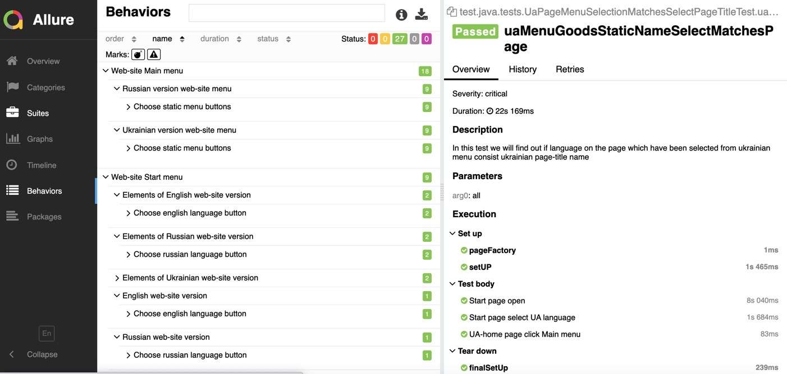

# PET-project

I've created this project with the purpose to demonstrate how I am proficient in technologies and automated testing tools.
 
 The goal of the project is to test several typical user scenarios on the site of the online clothing store https://cabanchi.com/.

 **To run all tests, please use**
 
 ```mvn clean -DsuiteXmlFile=allTests.xml test```
 
 **To generate Allure report, please use** 
 
 ```allure generate -c -o allure-report```
 
 To visualise Allure report, please use this path
 
 ```PET-project/allure-report```
 ```index.html```
 
 **Allure report example**
 
 
 
 **To run single tests please use the appropriate XML-files.** 

 To find out if Start menu can select correct web-site language version by finding keyword at page bottom text

 ```localizationTestByText.xml ```

 To find out if Start menu can select correct web-site language version by checking status of language-header element

 ```localizationTestByStatusOfWebElements.xml ```

 To find out if Start menu can select correct web-site language version by checking active language-header element's color
 
  ```localizationTestByColorOfWebElements.xml ```

 To find out if language on the page which have been selected from russian and ukrainian menu consist appropriate page-title name

 ```pageMenuSelectionMatchesSelectPageTitleTest.xml ```
